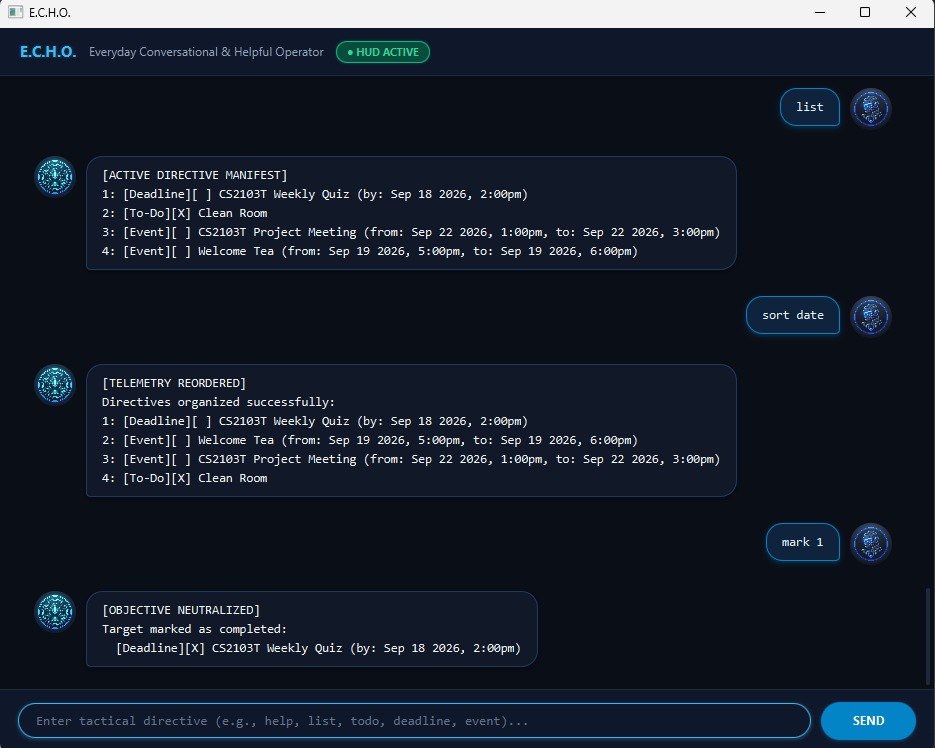

# E.C.H.O. User Guide

**E.C.H.O. (Everyday Conversational & Helpful Operator)** is a desktop task manager optimized for fast typists. It combines a conversational, tactical sci-fi chat interface with the efficiency of command-line task tracking.

---

## Quick Start

1. Ensure you have **Java 25** or later installed.
2. Download the latest `echo.jar` or launch the project from IntelliJ / `./gradlew run`.
3. The graphical chat window will open:

   

4. Type a command in the input box and press **Enter** (or click **Send**) to execute it. Some quick commands to try:
   - `help` : Displays the tactical protocol manual.
   - `todo read Dune` : Adds a new to-do task.
   - `deadline submit lab report /by 30-09-2026 23:59` : Adds a task with a deadline.
   - `list` : Shows all logged directives with their task numbers.
   - `bye` : Closes E.C.H.O.

---

## Command Format Notes

* **`<UPPER_CASE>`** : Parameters to be supplied by you.
  * E.g., in `todo <DESCRIPTION>`, `<DESCRIPTION>` is a required field like `read book`.
* **`[SQUARE_BRACKETS]`** : Optional parameters.
  * E.g., in `sort [CRITERIA]`, `[CRITERIA]` can be omitted or specified as `date` or `name`.
* **Date & Time Format** : Dates must be formatted as `dd-mm-yyyy` (e.g., `15-10-2026`). An optional 24-hour time can be added as `HH:MM` (e.g., `15-10-2026 18:30`).
* **Delimiters** : The pipe character (`|`) is reserved for storage and cannot be used in descriptions.
* **Task Numbers** : Numbers refer to the 1-based index shown in the `list` manifest.

---

## Features

### 1. View Help: `help`
Displays a quick reference manual of all supported commands and syntax.

* **Format**: `help`
* **Example**: `help`

---

### 2. List All Directives: `list`
Displays all recorded tasks with their completion status (`[X]` for done, `[ ]` for in-progress), category tag, and 1-based task number.

* **Format**: `list`
* **Example**: `list`

---

### 3. Add a To-Do: `todo`
Logs a task without any date or time constraints.

* **Format**: `todo <DESCRIPTION>`
* **Examples**:
  * `todo prepare lecture slides`
  * `todo buy groceries`

---

### 4. Add a Deadline: `deadline`
Logs a task that must be completed by a specific due date and optional time.

* **Format**: `deadline <DESCRIPTION> /by <DD-MM-YYYY> [HH:MM]`
* **Examples**:
  * `deadline submit assignment /by 30-09-2026`
  * `deadline project milestone /by 15-10-2026 23:59`

---

### 5. Add an Event: `event`
Logs an event that takes place over a time interval. The start date/time must be strictly before the end date/time. The `/from` and `/to` markers can be supplied in either order.

* **Format**: `event <DESCRIPTION> /from <START_DATE> [START_TIME] /to <END_DATE> [END_TIME]`
* **Examples**:
  * `event hackathon /from 05-10-2026 /to 07-10-2026`
  * `event team sync /from 12-10-2026 14:00 /to 12-10-2026 16:00`

---

### 6. Mark Task as Completed: `mark`
Marks an active task as finished (`[X]`).

* **Format**: `mark <TASK_NUMBER>`
* **Example**: `mark 2`

---

### 7. Reopen Task as In-Progress: `unmark`
Reverts a completed task back to in-progress (`[ ]`).

* **Format**: `unmark <TASK_NUMBER>`
* **Example**: `unmark 2`

---

### 8. Delete a Task: `delete`
Purges a directive from memory and storage. Remaining tasks are automatically re-indexed.

* **Format**: `delete <TASK_NUMBER>`
* **Example**: `delete 3`

---

### 9. Find Tasks by Keyword: `find`
Scans all logged directives and lists those containing the specified keyword (case-sensitive substring match).

* **Format**: `find <KEYWORD>`
* **Examples**:
  * `find report`
  * `find meeting`

---

### 10. Sort Directives: `sort`
Organizes tasks either chronologically by date (`date`, default) or alphabetically by description (`name`). Sorted order is saved immediately.
* When sorting by `date`, dated deadlines and events are ordered chronologically; undated to-dos appear at the end.

* **Format**: `sort [date|name]`
* **Examples**:
  * `sort` (defaults to sorting by date)
  * `sort date`
  * `sort name`

---

### 11. Exit Application: `bye`
Disconnects the session and exits E.C.H.O.

* **Format**: `bye`

---

### 12. Automatic Data Saving
All task changes (adding, marking, deleting, sorting) are saved automatically to `./data/echo.txt`.
* If corrupted lines are detected on startup, E.C.H.O. skips them safely, alerts you in the welcome message, and creates a backup file (`echo.txt.corrupted.bak`) before saving new data.

---

## Command Summary

| Action | Format | Example |
|---|---|---|
| **Help** | `help` | `help` |
| **List** | `list` | `list` |
| **To-Do** | `todo <DESCRIPTION>` | `todo read textbook` |
| **Deadline** | `deadline <DESCRIPTION> /by <DD-MM-YYYY> [HH:MM]` | `deadline submit quiz /by 28-09-2026 18:00` |
| **Event** | `event <DESCRIPTION> /from <START> /to <END>` | `event workshop /from 01-10-2026 10:00 /to 01-10-2026 13:00` |
| **Mark** | `mark <TASK_NUMBER>` | `mark 1` |
| **Unmark** | `unmark <TASK_NUMBER>` | `unmark 1` |
| **Delete** | `delete <TASK_NUMBER>` | `delete 2` |
| **Find** | `find <KEYWORD>` | `find assignment` |
| **Sort** | `sort [date\|name]` | `sort date` |
| **Exit** | `bye` | `bye` |
